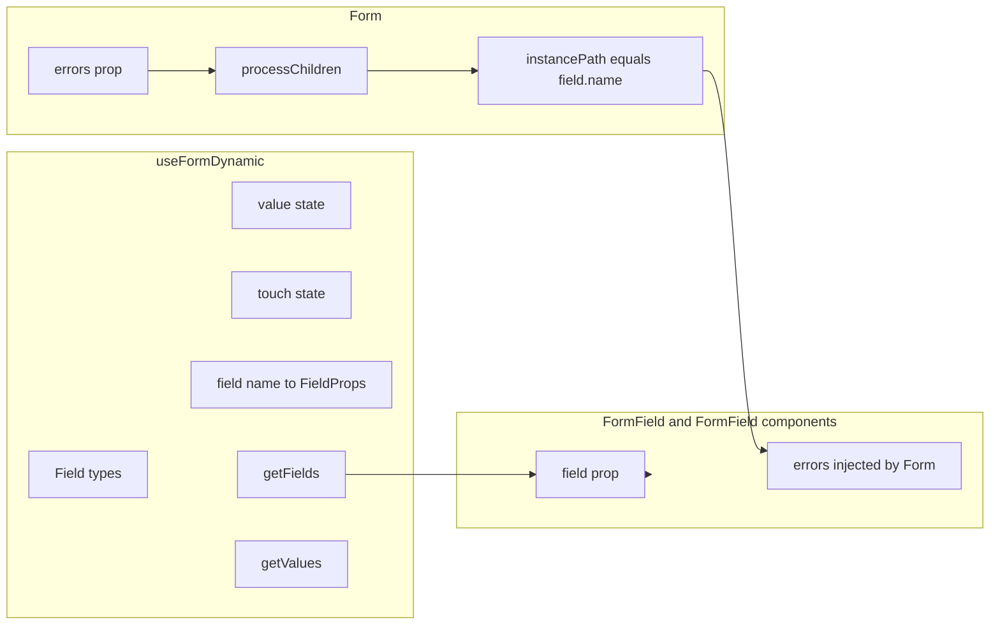

# Overview

The Aura Form system gives you a declarative way to handle forms: define field types once, get bound state and handlers, and let the Form component wire validation errors to the right fields. Built on Radix UI Form primitives and designed to work with JSON Schema validation (e.g. [AJV](https://ajv.js.org/)).

## Motivation

Most form libraries either lock you into a specific validation or UI pattern, or leave you wiring state and errors by hand. Aura Forms aims for:

- **Declarative structure** – Define your form with field names and types; the hook provides values, touch state, and field props.
- **Shared state** – One place for values, errors, touch, and submit status so validation and UI stay in sync.
- **Automatic error distribution** – Pass an array of validation errors to `Form`; it matches errors to fields by name and injects them into the right components.
- **Composable fields** – Use `FormField` for native inputs, or composed components like `FormFieldSelect`, `FormFieldCombobox`, `FormFieldEditor`, `FormFieldSignaturePad`, and `FormFieldSortableList` that all consume the same `field` prop.

## Architecture

The system has three parts that work together:



- **`useFormDynamic`** – Defines field types, holds values/touch/error/fetchStatus, and exposes `field(name)`, `getFields()`, `getValues()`, `resetForm()`, and `touchForm()`.
- **`Form`** – Receives `errors` (e.g. AJV `ErrorObject[]`), walks its children, and injects `errors` into any descendant that has a `field` prop by matching `error.instancePath.slice(1)` to `field.name`.
- **Form field components** – Accept `field` (from `getFields()` or `field(name)`) and optional `errors` (injected by Form). They use `field.value`, `field.setValue`, and for native inputs `field.onChange` / `field.onCheckedChange`, and show messages when `field.touch && errors?.length > 0`.

## Quick example

Minimal form with validation and submit handling:

```tsx
import { useRef } from "react";
import {
  Form,
  FormField,
  FormSubmit,
  FormAlert,
} from "@/components/ui/Form";
import { Input } from "@/components/ui/Input";
import { useFormDynamic } from "@/hooks/use-dynamic-form";
import { validateFormData } from "@/utils/web-validation";

const schema = {
  type: "object",
  properties: {
    name: { type: "string" },
    email: { type: "string", format: "email" },
  },
  required: ["name", "email"],
};

export function QuickForm() {
  const formRef = useRef<HTMLFormElement>(null);
  const formData = useFormDynamic({
    name: "text",
    email: "text",
  });

  const { name, email } = formData.getFields();
  const { isValid, errors } = validateFormData(schema, formData.getValues());
  const formErrors = errors ?? undefined;

  const handleSubmit = async (e: React.FormEvent<HTMLFormElement>) => {
    e.preventDefault();
    formData.setFetchStatus("loading");

    if (!isValid) {
      formData.setFetchStatus("error");
      formData.touchForm();
      formData.setError("Please complete all required fields");
      return;
    }

    // Simulate or call your API
    await new Promise((r) => setTimeout(r, 500));
    formData.setFetchStatus("success");
  };

  return (
    <Form
      ref={formRef}
      onSubmit={handleSubmit}
      errors={formErrors}
      id="quick-form"
      className="flex flex-col gap-1"
    >
      <FormAlert
        formData={{
          fetchStatus: formData.fetchStatus,
          error: formData.error,
        }}
      />
      <FormField field={name} label="Name *">
        <Input type="text" placeholder="Your name" />
      </FormField>
      <FormField field={email} label="Email *">
        <Input type="email" placeholder="your@email.com" />
      </FormField>
      <FormSubmit
        fetchStatus={formData.fetchStatus}
        buttonProps={{ children: "Submit" }}
        form="quick-form"
      />
    </Form>
  );
}
```

## Next steps

- **[useFormDynamic](/docs/forms/use-dynamic-form)** – Hook API, parameters, return value, and `FieldProps`.
- **[Form components](/docs/forms/form-components)** – `Form`, `FormSubmit`, `FormAlert`, `FormField`, `FormSwitch`, `FormCheckbox`, and groups.
- **[Form field composition](/docs/forms/form-field-composition)** – `FormFieldSelect`, `FormFieldCombobox`, `FormFieldEditor`, `FormFieldSignaturePad`, `FormFieldSortableList`.
- **[Validation](/docs/forms/validation)** – `validateFormData`, error shape, touch behavior, and form-level errors.

For installation and more demos, see [Form (component)](/docs/components/form).
